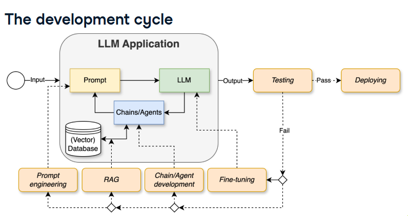

# Development Phase

## Prompt Engineering

A well-structured prompt should include the following components:

1. **Instruction**
   - Clearly define the task or objective.
   - Specify what the model should accomplish.

2. **Example / Context**
   - Provide background information or examples.
   - Include few-shot examples when helpful.

3. **Input Data**
   - Supply the data, text, or variables the model should process.

4. **Output Indicator**
   - Describe the expected output format.
   - Specify any constraints (e.g., JSON, Markdown, bullet list, word count).

---

## LLM Experimentation

Experiment with different model configurations to evaluate output quality.

### Parameters to Test

- **Model**
  - Compare different LLMs (e.g., GPT-4.1, GPT-5.5, Claude, Gemini, etc.)

- **Temperature**
  - Lower (0.0–0.3): More deterministic and consistent.
  - Medium (0.4–0.7): Balanced creativity and accuracy.
  - Higher (0.8–1.0+): More creative and diverse outputs.

- **Max Tokens**
  - Control the maximum response length.
  - Optimize for completeness without unnecessary verbosity.

- **Context Window**
  - Test how much context improves response quality.
  - Evaluate retrieval or long-context prompting strategies.

- **Prompt Design Patterns**
  - Zero-shot prompting
  - One-shot prompting
  - Few-shot prompting
  - Chain-of-thought (when appropriate)
  - Role prompting
  - Step-by-step prompting
  - Structured output prompting
  - Retrieval-Augmented Generation (RAG)

---

# Prompt Management

Maintain a record of prompt experiments for reproducibility and comparison.

| Prompt | Model | Settings | Output | Notes |
|---------|-------|----------|--------|-------|
| Prompt text | GPT-5.5 | Temp: 0.2, Max Tokens: 500 | Response | Observations |
| ... | ... | ... | ... | ... |

---

# Prompt Templates

Create reusable prompt templates for common tasks.

## Basic Template

```text
Instruction:
{instruction}

Context:
{context}

Input:
{input}

Constraints:
{constraints}

Expected Output:
{output_format}
```

## Summarization Template

```text
Summarize the following content.

Context:
{context}

Text:
{text}

Requirements:
- Preserve key points.
- Use bullet points.
- Keep under {word_limit} words.
```

## Information Extraction Template

```text
Extract the following information from the input.

Input:
{text}

Fields:
- Name
- Date
- Organization
- Key Points

Return the result as JSON.
```

## Content Generation Template

```text
Role:
You are a {role}.

Task:
{task}

Context:
{context}

Requirements:
- {requirement_1}
- {requirement_2}

Output Format:
{format}
```

---

# Best Practices

- Write clear and specific instructions.
- Provide sufficient context.
- Specify the desired output format.
- Test multiple prompt variations.
- Track prompt performance and model settings.
- Reuse successful prompts as templates.
- Iterate and refine prompts based on results.

# Chain vs Agent

## Chain 

  - Deterministic
  - Low risk due to predictability

## Agent

  - Adaptive
  - LLM decides what action to take
  - Useful when the optimal sequence of steps is unknown

# RAG vs Fine-tuning

  ## RAG

    1. Retrieve
      - Generate embeddings
      - Seach vector database
      - Retrieve most similar documents
    2. Augment
      - combine input with top k and create augmented prompt
    3. Generate
      - Uses prompt to generate output

  ## Fine-tuning

    1. Supervised fine-tuning (Transfer Learning)
    2. Reinforcement Learning from Human Feedback (RLHF)

  // Use RAG to include factual knowledge.
  // Use Finetuning when specializing in a new domain.

# Testing 

Step 1: Build a test set
Step 2: Choose a metric

 